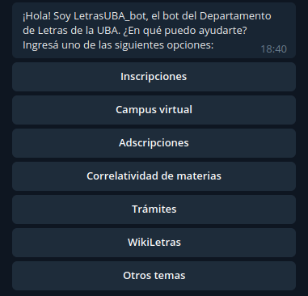

# Generic but customizable telegram bot
### A dockerized telegram bot app running on gunicorn. 

## Requirements
* docker
* python 3.7
* pip
* google-cloud-sdk


## Features

### Bot UI
It uses InlineKeyboard feature to show an app-menu like interface that looks like this:



### Bot app config
Menus and their options are config-based and app config lives at Google Sheets!

To add/remove/change menus or options, just edit them in Sheets.  

Deploy scripts will fetch data and update everything automagically :)


## Google Sheets integration

* google sheets auth is done through `./client_secrets.json`
* `src/store.py` fetches and parses csv files.  
it can be executed in standalone mode for testing purposes:
```bash
$ python src/store.py
``` 
* mapped menu objects are written as binary to `lang/slot_items.json`.
this file is then added to the container


## Deploy

### Setting up .secrets config file:
* Add your TOKEN and TEST_TOKEN (optional) for telegram-bot authentication
* PORT (We use 8888 for Mac and 80 for Linux)

### Production environment
Deploy on Google Cloud Run

```bash
$ ./deploy-prod.sh
```

### Staging environment

```bash
# install requirements 
$ pip3 install requirements.txt

# deploy using docker + ngrok 
$ ./deploy-staging.sh
```

